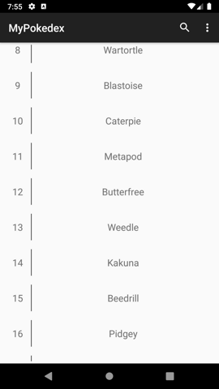
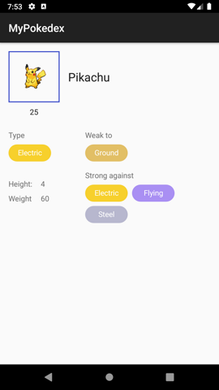

# MyPokedex

### About
A toy app written on Kotlin to learn several technologies (for myself). May contain bugs and WIPs

The app is using  [PokeAPI](https://github.com/PokeAPI/pokeapi) which is free of charge and free of authentication requirement. 
Make sure to donate to it to keep it up.

Also follow it's [fair use policy](https://pokeapi.co/docs/v2.html#fairuse) .
One of the rules is to cache the query results which is done in this app using rxjava2 and Room.

### Brief list of technologies used
- Dagger2 
- RxJava2 (plus various extensions)
- Retrofit2
- Gson
- Moxy (androidx version by schoolhelper)
- Glide
- Android Architecture Components:
  - Room
  - Navigation
  - Data binding
  - Paging